<ol style="list-style: none;">
				<li><h4>准备好 JDK安装包</h4></li>
				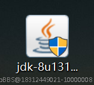
				<li><h4>双击左键,点击下一步</h4></li>
				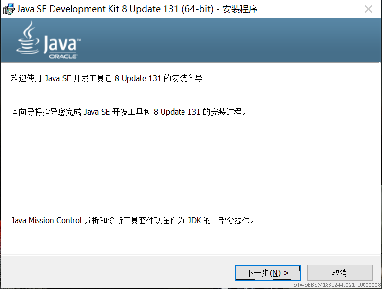
				<li><h4>点击“公共JRE”，选择“此功能及所有子功能将安装在本地硬盘上”。</h4><h5>此软件为了好调用环境，不要更改安装路径。继续下一步</h5></li>
				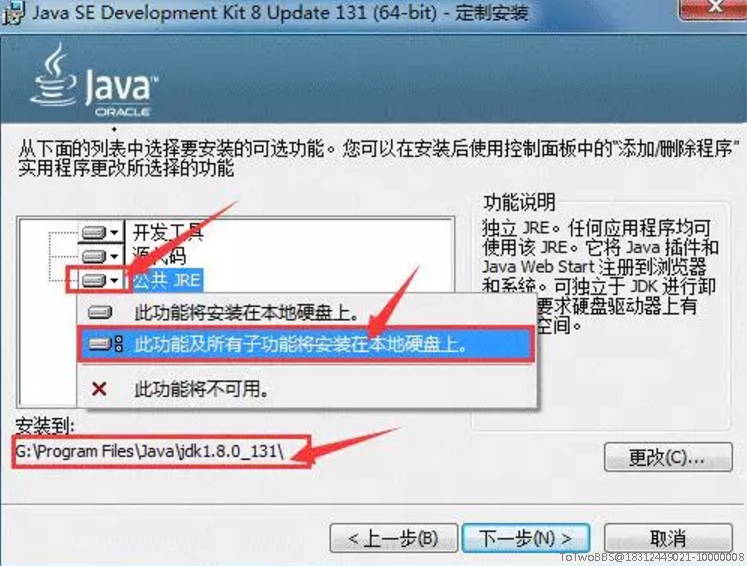
				<li><h4>等待安装。</h4></li>
					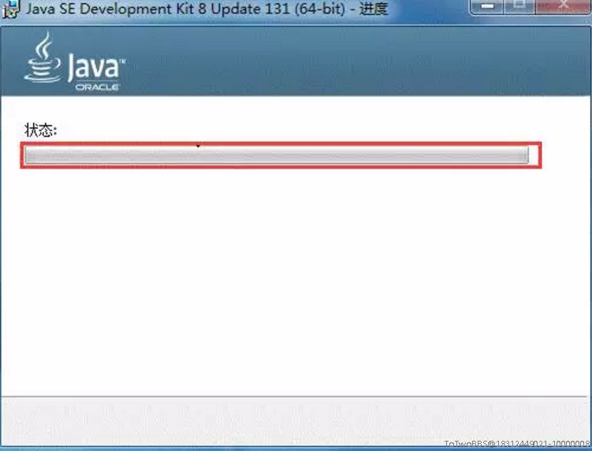
				<li><h4>不要更改路径，点击“下一步”。等待安装。安装完成后点击“关闭”。</h4></li>
				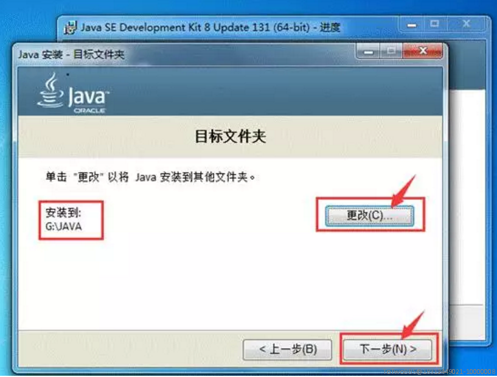
				<li><h4>配置Java运行环境。</h4></li>
				<li><h4>返回桌面    右击“计算机”。点击“属性”。</h4></li>
				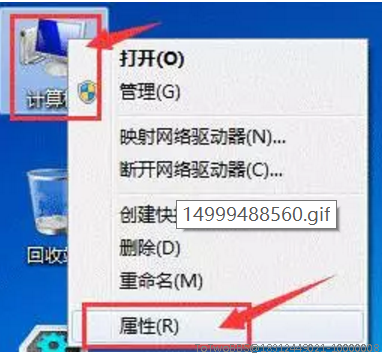
				<li><h4>点击“高级系统设置”。</h4></li>
				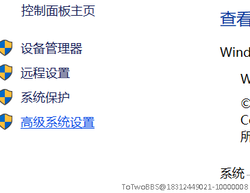
				<li><h4>点击“高级”，再点击“环境变量”。</h4></li>
				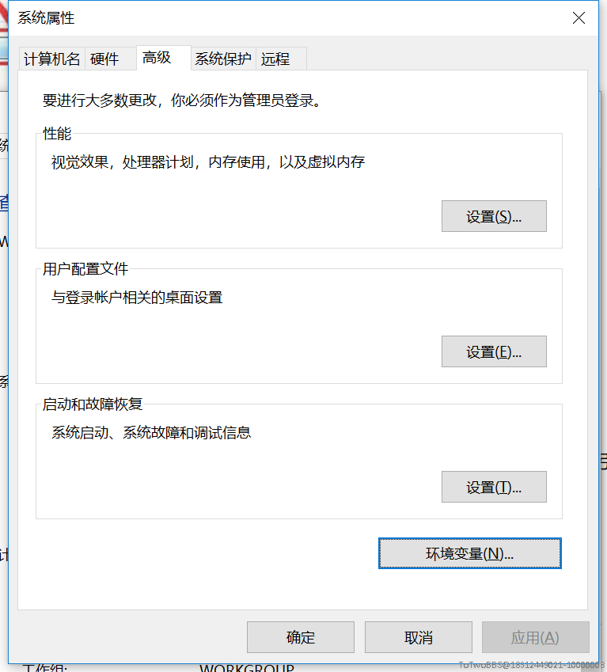
				<li><h4>点击“新建”。变量名输入“<text>JAVA_HOME</text>”，变量值输入Java软件安装路径。如 “<text>C:\Program Files\Java\jdk1.8.0_131</text>”</h4></li>
				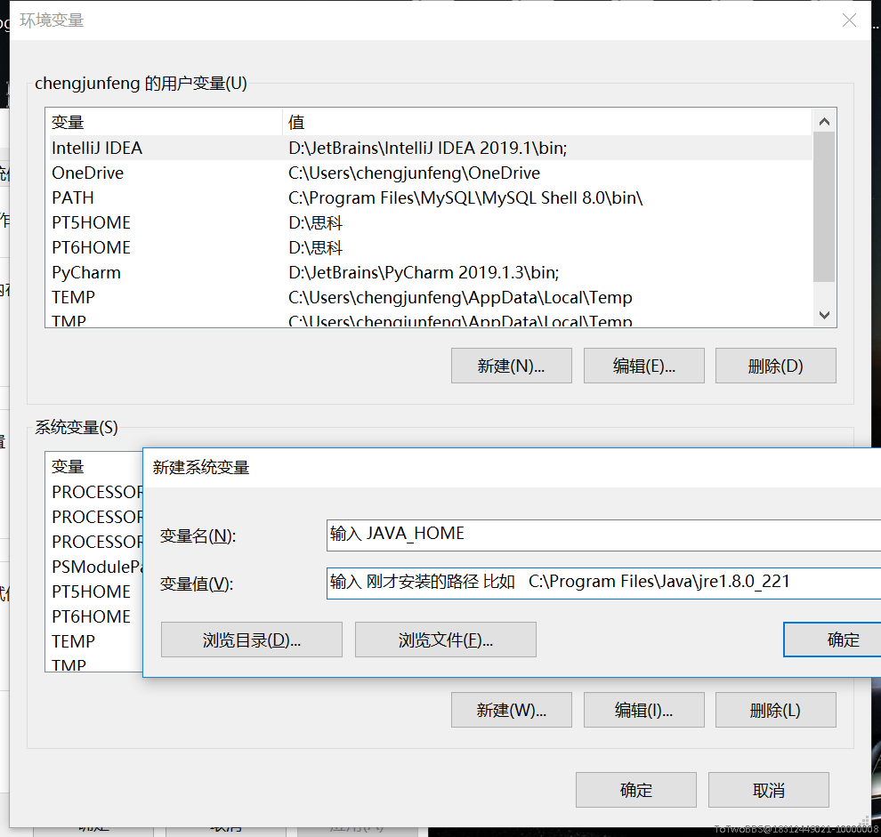
				<li><h4>继续点击“新建”，变量名输入“<text>CLASSPATH</text>”变量值输入“<text>.;%JAVA_HOME%\lib\dt.jar;%JAVA_HOME%\lib\tools.jar;</text>”。说明：双引号不要输入或复制到。在系统变量中找到“<text>Path</text>”,点击“编辑”。在后面加入“<text>%JAVA_HOME%\bin</text>”。说明：双引号不要输入或复制到。点击确定确定</h4></li>
				<li><h4>返回桌面，同时按键盘上的“WIN键+R键”。输入“cmd”。点击确定。</h4></li>
				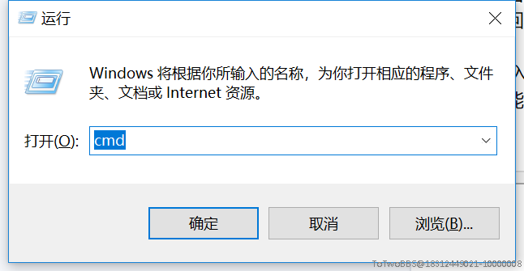
				<li><h4>.输入“java -version”。按一下“回车键”（Enter） 。出现一下文字说明安装成功。如果出现其他文字。说明安装失败，你可能需要从第23步重新配置。</h4></li>
				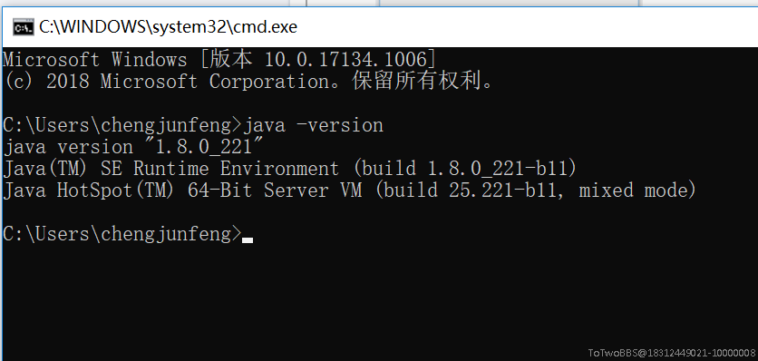
				<li><h4>安装成功</h4></li>

</ol>

<h5 style="margin-top: 5rem;">由俊峰提供技术支持 - ToTwoStudio</h4>
